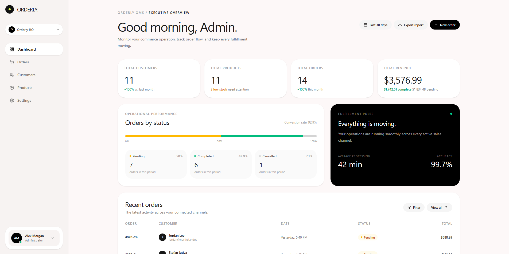
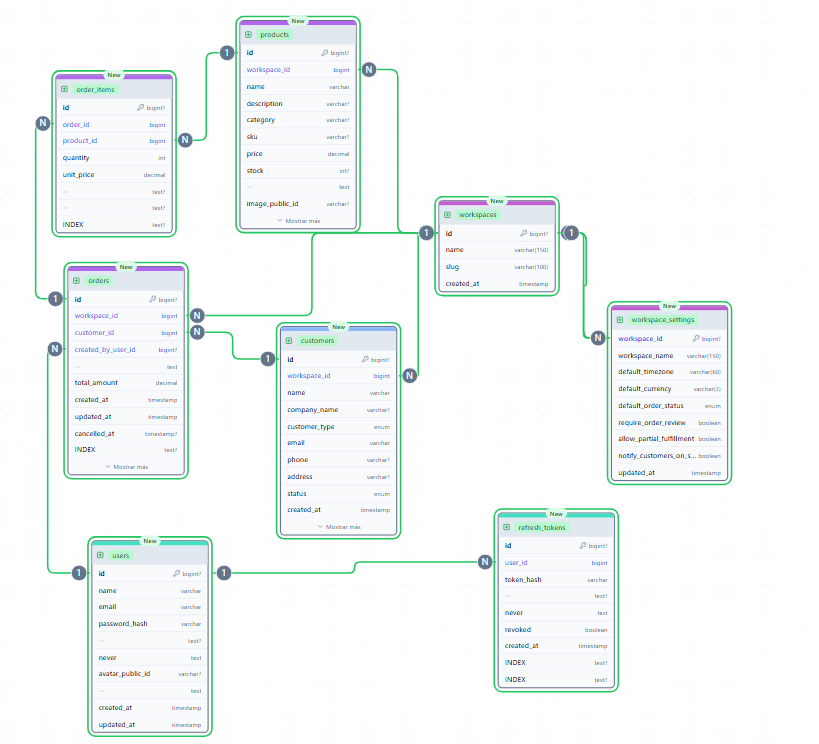
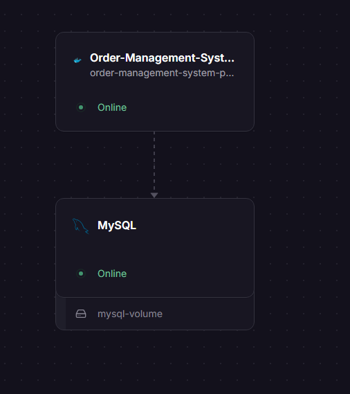

# Order Management System

A small Order Management System built with **NestJS**, **Next.js**, and **MySQL**, allowing an internal team to manage customers, products, and orders across multiple workspaces.

**Live demo:**
- Frontend: https://order-management-system-coral.vercel.app
- Backend API: https://order-management-system-production-8314.up.railway.app/api

**Default login:**
- Email: `admin@orderly.com`
- Password: *(set via seed script — see Setup below)*

---

## Screenshots

### Frontend



### Database ER Diagram



### Infrastructure (Railway)



---

## Tech Stack

- **Backend:** NestJS, TypeORM, MySQL 8
- **Frontend:** Next.js (App Router), TypeScript, Tailwind CSS
- **Auth:** JWT (access token), httpOnly cookies, Next.js middleware route protection
- **Containerization:** Docker + Docker Compose
- **CI/CD:** GitHub Actions (code quality + automated tests against a real MySQL instance)
- **Hosting (demo):** Railway (backend + MySQL), Vercel (frontend)

---

## Project Structure

```
order-management-system/
├── backend/                # NestJS API
│   ├── src/
│   │   ├── auth/
│   │   ├── users/
│   │   ├── customers/
│   │   ├── products/
│   │   ├── orders/
│   │   ├── workspaces/
│   │   ├── workspace-settings/
│   │   ├── dashboard/
│   │   ├── uploads/
│   │   ├── common/
│   │   ├── config/
│   │   └── database/
│   ├── test/                # e2e tests
│   ├── scripts/
│   │   └── schema.sql      # Full DB schema, ready to run from scratch
│   ├── Dockerfile
│   └── package.json
│
├── frontend/                # Next.js app
│   ├── app/
│   ├── components/
│   ├── lib/
│   │   ├── api/
│   │   ├── hooks/
│   │   └── types/
│   ├── Dockerfile
│   └── package.json
│
├── docs/
│   └── screenshots/         # Images referenced in this README
│
├── .github/
│   └── workflows/
│       └── ci.yml           # Code quality + automated tests
│
├── docker-compose.yml
└── README.md
```

---

## Setup Instructions

### Prerequisites

- Node.js 20+
- Docker & Docker Compose (recommended — runs everything with one command)
- A MySQL 8 instance if running services outside Docker

### Option A — Run everything with Docker Compose (recommended)

From the project root:

```bash
cp .env.example .env   # adjust secrets if desired
docker-compose up --build
```

This automatically:
- Starts MySQL and loads the full schema (`backend/scripts/schema.sql`) on first run — no manual SQL steps needed
- Builds and starts the backend at `http://localhost:3000/api`
- Builds and starts the frontend at `http://localhost:3001`

To reset the database completely (re-run the schema from scratch):

```bash
docker-compose down -v
docker-compose up --build
```

**Creating the admin user:** the schema does not seed a user automatically (passwords must be hashed). After the containers are up:

```bash
docker exec -it oms-backend node -e "console.log(require('bcrypt').hashSync('YourPassword123', 10))"
```

Then insert it directly into MySQL:

```bash
docker exec -it oms-mysql mysql -uroot -p order_management
```

```sql
INSERT INTO users (name, email, password_hash, role)
VALUES ('Admin', 'admin@orderly.com', '<paste-hash-here>', 'admin');
```

### Option B — Run services manually (without Docker)

#### 1. Database

```bash
mysql -h <host> -P <port> -u <user> -p < backend/scripts/schema.sql
```

Create the admin user the same way as described above (generate a bcrypt hash, then `INSERT` it).

#### 2. Backend

```bash
cd backend
cp .env.example .env   # fill in DB credentials, JWT secrets, etc.
npm install
npm run start:dev
```

API available at `http://localhost:3000/api`.

#### 3. Frontend

```bash
cd frontend
cp .env.example .env   # set NEXT_PUBLIC_API_URL=http://localhost:3000/api
npm install
npm run dev
```

App available at `http://localhost:3001` (or the port Next.js assigns).

---

## API Overview

All endpoints are prefixed with `/api`. Most list/detail endpoints accept an optional `?workspaceId=` query parameter to scope results to a workspace (see **Multi-Workspace Support** below).

| Resource | Endpoints |
|---|---|
| Auth | `POST /auth/login` |
| Customers | `GET /customers`, `GET /customers/:id`, `POST /customers`, `PATCH /customers/:id`, `DELETE /customers/:id` |
| Products | `GET /products`, `GET /products/:id`, `POST /products`, `PATCH /products/:id`, `DELETE /products/:id` |
| Orders | `GET /orders`, `GET /orders/:id`, `GET /orders/summary`, `POST /orders`, `PATCH /orders/:id/status` |
| Dashboard | `GET /dashboard/summary` |
| Workspaces | `GET /workspaces`, `GET /workspaces/:id`, `POST /workspaces` |
| Workspace Settings | `GET /workspace-settings?workspaceId=`, `PATCH /workspace-settings?workspaceId=` |

**Pagination:** `GET /customers`, `/products`, and `/orders` accept optional `?page=` and `?limit=` query params. When omitted, the endpoint returns the full result set as a plain array (kept for backward compatibility). When provided, the response shape becomes `{ data: [...], meta: { total, page, limit, totalPages } }`.

**API documentation:** Swagger UI is available at `/api/docs` once the backend is running (e.g. `http://localhost:3000/api/docs`).

Validation is handled via `class-validator` DTOs on every write endpoint (`whitelist` + `forbidNonWhitelisted` enabled globally), and errors return structured JSON with appropriate HTTP status codes (400, 404, 409, etc.).

---

## Testing & CI/CD

The project includes both unit and end-to-end tests, run automatically on every push and pull request via **GitHub Actions**.

### Pipeline structure (`.github/workflows/ci.yml`)

The pipeline runs as two sequential jobs:

**1. `quality` — Code Quality**
- ESLint (`npm run lint`)
- Prettier format check (`prettier --check`)
- TypeScript type check (`tsc --noEmit`)
- Dependency security audit (`npm audit`, non-blocking)

**2. `test` — Tests** *(runs only if `quality` passes)*
- Spins up a real **MySQL 8 service container**
- Loads the full `schema.sql` against it — the CI database is structurally identical to production
- Runs unit tests (mocked repositories, covering business logic like order status transitions and duplicate email/SKU validation)
- Runs the production build
- Runs end-to-end tests with Supertest against the running NestJS app connected to the real MySQL instance — covering the full order creation flow (customer → product → order → status transition → rejected invalid transition)

### Running tests locally

```bash
cd backend

# Unit tests
npm run test

# E2E tests (requires a running MySQL instance with the schema loaded,
# e.g. via `docker-compose up -d mysql`)
npm run test:e2e

# Lint
npm run lint
```

---

## Technical Decisions & Assumptions

### Database structure

- **Customers ↔ Orders ↔ Products** is a classic 1:N / M:N model: a customer has many orders, and orders relate to products through an `order_items` join table (an order can contain many products, a product can appear in many orders, each with its own quantity).
- **Soft deletes** (`deleted_at`) are used for `customers` and `products` instead of hard deletes. This preserves referential integrity with historical orders (`orders.customer_id` and `order_items.product_id` both use `ON DELETE RESTRICT`) — you can't hard-delete a customer or product that has order history without breaking past records.
- **Indexes** were added on all frequently filtered/searched columns (status, name, email, category, workspace_id, created_at) to keep queries fast as data grows.
- See the ER diagram above for the full schema and relationships.

### Product price changes

If a product's price changes after an order was created, **existing orders are not affected**. Each `order_items` row stores a `unit_price` snapshot taken at order-creation time, and `subtotal` is a MySQL generated column (`quantity * unit_price` — `GENERATED ALWAYS ... STORED`). This mirrors how real invoicing systems work: a receipt doesn't change retroactively if the product's price changes tomorrow.

### Order cancellation & status transitions

Orders support exactly the three states required: `pending`, `completed`, `cancelled`. Allowed transitions:

- `pending → completed` ✅
- `pending → cancelled` ✅
- `completed → *` ❌ (terminal state)
- `cancelled → *` ❌ (terminal state)

Once an order is completed or cancelled, it cannot be reopened. Reopening would require a separate "reverse"/"refund" workflow with its own audit trail, out of scope here. The rules live in a single lookup table (`ALLOWED_TRANSITIONS` in `orders.service.ts`) for easy extension later, and are covered by unit tests.

### Multi-workspace support

The system supports a lightweight multi-workspace model (inspired by Odoo's multi-company concept), added as a deliberate extension beyond the base requirements:

- **Customers, Products, and Orders are scoped per workspace** (`workspace_id` foreign key, with unique constraints like email/SKU scoped to the workspace rather than global).
- **Workspace Settings are per-workspace** (currency, timezone, order defaults) and are fully editable from the UI (Settings → Workspace tab), including renaming the workspace itself.
- **New workspaces can be created directly from the UI**, which also provisions a default settings row automatically.
- **Users (the internal team) are global** — any authenticated user can switch between and operate in any workspace, reflecting the scenario described in the test (a single internal team managing operations), rather than isolated tenants with separate user bases.
- There is **no per-user workspace permission system** — a deliberate simplification, since full multi-tenant isolation would add complexity not justified by the stated requirements.
- The active workspace is persisted client-side in a plain (non-sensitive) cookie, decoupled from the JWT, and a browser custom event keeps every open component in sync the moment the workspace changes.

### Currency handling

The system assumes **one operating currency per workspace**, not per-order or multi-currency simultaneously. Monetary values are stored as plain `DECIMAL(10,2)` without a currency code on each row. True multi-currency support (per-order currency, exchange rate tracking, storing amounts in minor units to avoid rounding errors) would require meaningfully more complexity not justified for a single-company internal tool.

### Authentication

- JWT access tokens (15 min expiry), verified via a Passport JWT strategy. Passwords hashed with `bcrypt`.
- The frontend stores the token in an httpOnly cookie (not `localStorage`), set by a Next.js Route Handler that proxies the login request — preventing the token from being readable by client-side JavaScript (XSS mitigation).
- A Next.js `middleware.ts` protects all internal routes at the edge, redirecting unauthenticated visitors to `/login` before any page renders.
- A `refresh_tokens` table exists in the schema for future session renewal, but the refresh flow itself is not yet implemented (see Known Limitations).

### API design

- RESTful resource-based structure, with nested actions expressed as sub-paths (`/orders/:id/status`) rather than overloading the base resource.
- Query-string filtering (`?status=`, `?search=`, `?workspaceId=`, `?page=`, `?limit=`) instead of separate endpoints per filter combination.
- Validation errors, not-found errors, and conflict errors return distinct HTTP status codes (400, 404, 409) with descriptive messages.

### Scalability considerations

- **Indexes** on all frequently filtered/searched columns.
- **Price snapshotting** avoids joins with `products` for historical order data.
- **Soft deletes** avoid breaking referential integrity at scale.
- **Pagination** on all list endpoints prevents full-table scans as data grows into the thousands.
- **Connection pooling** handled by TypeORM's default pool.

Not implemented in this submission, but noted as production next-steps:
- Redis caching for read-heavy endpoints.
- Read replicas or materialized views for dashboard aggregations at very large scale.
- Rate limiting via `@nestjs/throttler`.
- Versioned database migrations instead of schema auto-sync (production should use TypeORM migrations for controlled, incremental changes).

---

## Known Limitations

- **No automated frontend tests** — backend has unit + e2e coverage; the frontend was tested manually.
- **Backend endpoints are not protected with JWT guards** — the frontend blocks unauthenticated navigation, but the API itself would currently accept unauthenticated requests if called directly. Adding `@UseGuards(JwtAuthGuard)` to each controller is the natural next step.
- **Refresh token flow is not implemented** — the access token simply expires after 15 minutes and the user must log in again.
- **No per-user workspace permissions** — any logged-in user can access and modify any workspace.
- **Image upload is scaffolded but not fully wired** to a live Cloudinary account in this submission.
- **Single-stage Docker builds** for both backend and frontend (simpler, but produce larger images than multi-stage builds would, since devDependencies remain in the final image).

---

## AI Development Tools

This project was built with the assistance of Claude (Anthropic) throughout the development process — used for scaffolding NestJS modules, debugging deployment issues (Docker, Railway, TypeORM/MySQL quirks), setting up the CI/CD pipeline, and iterating on the Next.js frontend. All generated code was reviewed, tested against a live MySQL instance, and adjusted where AI suggestions didn't match actual runtime behavior. Notable examples of issues caught and fixed during development:

- A TypeORM `GENERATED ALWAYS AS (...) STORED` column (`order_items.subtotal`) was initially mismapped, causing insert failures — fixed by explicitly declaring `generatedType`/`asExpression` so TypeORM excludes it from INSERT statements entirely.
- MySQL's `mysql2` driver returns `BIGINT` columns as strings at runtime despite TypeORM typing them as `number`. This surfaced twice: once as a silent `Map` key mismatch when matching order items to products, and again as a `class-validator` 400 error when e2e tests sent an `id` fresh from a previous response back into a `POST` body — both fixed by explicit `Number()` conversion / `@Type(() => Number)` on the relevant DTOs.
- A missing `workspace_settings` row for a given workspace initially caused a hard 404; the service was updated to auto-provision a default settings row when a workspace exists but its settings don't.
- A cascading e2e test failure (`Unknown column 'NaN'`) traced back to a single missing type coercion in `CreateOrderDto`, illustrating how one validation gap can produce misleading downstream errors — resolved at the root cause rather than patched per symptom.
